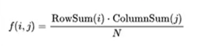
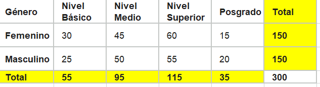
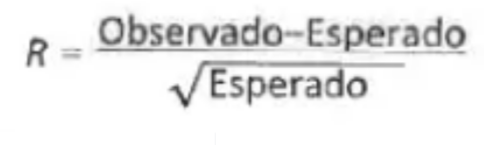
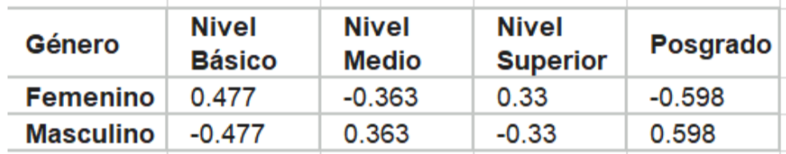
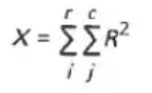
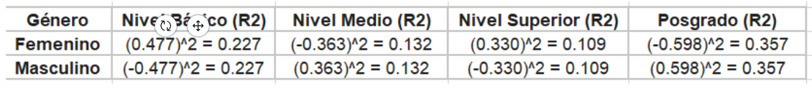

# Statistical Experiments and Significance Testing
---

# Pruebas A/B y pruebas de hipótesis

Basada en el capítulo 3 de _Practical Statistics for Data Scientists_

## 1. Introducción

Los experimentos estadísticos permiten estudiar el efecto de una modificación y comparar alternativas a partir de datos. En ciencia de datos se utilizan, por ejemplo, para evaluar diseños de páginas web, precios y anuncios. Sin embargo, que una alternativa obtenga un resultado mayor en una muestra no demuestra, por sí solo, que sea mejor en la población. La diferencia también puede aparecer como consecuencia de la variación aleatoria.

Esta monografía tiene como objetivo explicar las pruebas A/B y las pruebas de hipótesis, así como la relación entre ambas. Se desarrolla una adaptación en español de las secciones correspondientes del capítulo 3 de Bruce, Bruce y Gedeck (2020, pp. 88–96), acompañada de ejemplos del libro e interpretaciones didácticas. El alcance se concentra en estos dos temas; los procedimientos de remuestreo y el cálculo de valores p corresponden a otras partes del trabajo grupal.

## 2. Pruebas A/B

Una prueba A/B es un experimento que compara dos tratamientos, productos o procedimientos mediante una medida de resultado. Un tratamiento es la condición a la que se expone una unidad experimental; no necesariamente se refiere a un medicamento. Puede ser un precio, un título de una página o un diseño. Los sujetos, por su parte, son las unidades que reciben esa condición, como personas, visitantes web o semillas (Bruce et al., 2020, p. 88).

Con frecuencia, A representa la opción habitual y B una propuesta nueva. La opción habitual funciona como control: proporciona una referencia para interpretar el resultado de la modificación. No obstante, las letras A y B solo identifican las alternativas; no indican de antemano cuál será superior.

### 2.1. Asignación aleatoria y grupo de control

La asignación aleatoria distribuye los sujetos entre los tratamientos mediante el azar. Su propósito es reducir los sesgos de selección y favorecer grupos comparables. No asegura que ambos grupos sean idénticos: todavía pueden existir diferencias accidentales en su composición. Por eso, incluso en un experimento bien diseñado, los resultados pueden variar por azar.

El control permite comparar las alternativas en condiciones semejantes. Si una tienda cambia su página y después vende más, el incremento también podría relacionarse con una campaña publicitaria o con una temporada de mayor demanda. Comparar simultáneamente la versión habitual y la nueva ayuda a separar estas influencias del cambio estudiado (Bruce et al., 2020, pp. 90–91).

### 2.2. La medida de evaluación

Antes de iniciar el experimento debe elegirse una medida principal relacionada con el objetivo. Si interesa aumentar las compras, puede utilizarse la tasa de conversión, es decir, la proporción de visitantes que compran. Si interesa el rendimiento económico, podría elegirse el ingreso por visita. Estas medidas responden a preguntas diferentes: una opción puede producir más compras, pero no necesariamente más ingresos por visitante.

Bruce et al. (2020, p. 91) advierten que seleccionar la medida después de observar los resultados abre la puerta al sesgo del investigador. En otras palabras, se podría escoger únicamente el indicador que favorece a la alternativa preferida. La decisión sobre qué significa “mejor” debe formar parte del diseño inicial del experimento.

### 2.3. Ejemplos de aplicación del libro

El libro menciona comparaciones entre dos tratamientos de suelo, dos precios, dos títulos web y dos anuncios. En el caso de los títulos, la pregunta es cuál genera más clics. La figura siguiente representa esta idea: se reparten visitantes al azar, cada grupo observa una versión y se registra la misma medida de respuesta.


Figura 1. Esquema propio de una prueba A/B, inspirado en el ejemplo de títulos web de Bruce et al. (2020, pp. 88–89, figura 3-2). No reproduce la imagen original.

Un ejemplo con datos aparece en la tabla 3-1 del libro, donde se comparan dos precios en un experimento de comercio electrónico. La información se presenta a continuación, con los totales y las tasas calculados a partir de los datos originales.

| Resultado              | Precio A | Precio B |
| ---------------------- | -------: | -------: |
| Compras (conversiones) |      200 |      182 |
| Sin compra             |   23 539 |   22 406 |
| Total de observaciones |   23 739 |   22 588 |
| Tasa de conversión     |  0,842 % |  0,806 % |

Tabla 1. Adaptación de la tabla 3-1 de Bruce et al. (2020, p. 90). Los totales y porcentajes son cálculos propios.

La tasa de A se obtiene dividiendo 200 entre 23 739 y multiplicando por 100; la de B, dividiendo 182 entre 22 588. A presenta una ventaja observada de aproximadamente 0,037 puntos porcentuales. Como los grupos tienen tamaños distintos, es más informativo comparar tasas que únicamente contar compras. Aun así, esta diferencia descriptiva no basta para concluir que A tenga una tasa poblacional mayor: es necesario evaluar la incertidumbre mediante una prueba apropiada.

## 3. Pruebas de hipótesis

Las pruebas de hipótesis permiten evaluar si los datos observados son compatibles con una suposición de referencia. En el contexto de un experimento A/B, ayudan a examinar si la variación aleatoria constituye una explicación razonable de la diferencia entre grupos. Su utilidad consiste en evitar que una fluctuación accidental se interprete inmediatamente como un efecto del tratamiento (Bruce et al., 2020, pp. 93–94).

La prueba A/B y la prueba de hipótesis cumplen funciones diferentes dentro del mismo proceso. La primera organiza la comparación y permite recoger los datos; la segunda aporta un marco para analizarlos. Además, las pruebas de hipótesis pueden aplicarse a otros problemas estadísticos y no se limitan a experimentos A/B.

### 3.1. Hipótesis nula e hipótesis alternativa

La hipótesis nula, representada como H₀, establece la suposición de referencia. En una comparación bilateral de tasas de conversión puede expresar que las tasas poblacionales son iguales. Esto no significa que las proporciones observadas en las muestras deban coincidir exactamente: bajo igualdad poblacional también pueden aparecer diferencias muestrales debidas al azar.

La hipótesis alternativa, H₁, expresa la posibilidad que se contrapone a la nula. Si p_A y p_B representan las tasas de conversión poblacionales de las dos opciones, las hipótesis de una comparación bilateral se escriben así:

> H₀: p_A = p_B.
> H₁: p_A ≠ p_B.

El análisis parte de un modelo bajo H₀ y examina qué tan compatible resulta la diferencia observada con ese modelo. Si la evidencia cumple el criterio de rechazo establecido, se rechaza H₀. Si no lo cumple, no se rechaza. Esta última decisión no demuestra que las alternativas sean iguales: expresa que los datos no proporcionan evidencia suficiente para rechazar la hipótesis nula.

### 3.2. Pruebas unilaterales y bilaterales

Una prueba unilateral considera una dirección específica. Por ejemplo, si se investiga si la nueva opción B aumenta la tasa de conversión respecto de A, la alternativa plantea que la tasa de B es mayor. En esta situación, las hipótesis son:

> H₀: p_B ≤ p_A.
> H₁: p_B > p_A.

Una prueba bilateral, en cambio, busca diferencias en cualquiera de las dos direcciones. Se utiliza cuando interesa saber si B cambia la tasa, tanto si la incrementa como si la reduce. En ese caso se emplean las hipótesis de igualdad y desigualdad presentadas anteriormente. El libro desarrolla esta distinción a partir de la decisión de conservar una opción habitual o sustituirla por una nueva (Bruce et al., 2020, p. 95).

La elección debe responder a la pregunta de investigación y realizarse antes de observar los resultados. Elegir la dirección después de descubrir qué grupo obtuvo una tasa mayor introduciría un sesgo. Por ello, formular las hipótesis no es un trámite posterior, sino una parte del diseño del análisis.

### 3.3. Ejemplo del libro: las rachas de una moneda

Para explicar por qué podemos interpretar mal el azar, el libro propone pedir a varias personas que inventen una secuencia de 50 lanzamientos de una moneda y que después realicen 50 lanzamientos reales. Las secuencias reales tienden a incluir rachas más largas de caras o sellos que las inventadas. Esto ocurre porque, al inventar una serie, solemos alternar los resultados demasiado pronto para que parezcan aleatorios (Bruce et al., 2020, pp. 93–94).

```text
C  C  C  C  C  S  C  S  S  C

C = cara; S = sello. Secuencia ilustrativa.
```

Figura 2. Ilustración propia del concepto de racha. La secuencia mostrada no corresponde a resultados reportados en el libro.

La enseñanza es que una racha llamativa no demuestra por sí misma la existencia de una causa especial. De manera semejante, un título web puede superar a otro en una muestra sin que exista una ventaja poblacional. Las pruebas de hipótesis permiten evaluar esa observación dentro de un modelo de variación aleatoria, en lugar de depender únicamente de la impresión que produce el resultado.

## 4. Interpretación de los temas

A partir de la lectura, se entiende que comparar resultados implica dos responsabilidades: realizar una comparación adecuada e interpretar sus diferencias con cuidado. La asignación aleatoria, el control y la elección previa de una medida contribuyen a la primera. La formulación de hipótesis y el análisis de la evidencia contribuyen a la segunda.

En el ejemplo de los precios, contar 200 compras para A y 182 para B no es suficiente para afirmar que A sea mejor. Primero deben considerarse los tamaños de los grupos; después debe evaluarse si la diferencia entre tasas es compatible con el azar. Además, una mayor tasa de compra no equivale necesariamente a una mayor rentabilidad. La conclusión debe corresponder a la medida que se decidió estudiar.

## 5. Conclusiones

Las pruebas A/B permiten comparar dos alternativas bajo un diseño experimental. Su interpretación mejora cuando los sujetos se asignan al azar, las condiciones son comparables y la medida principal se define antes de recoger los datos.

Las pruebas de hipótesis complementan esta comparación al evaluar los resultados respecto de una hipótesis nula. Distinguir entre hipótesis nula y alternativa, así como entre pruebas unilaterales y bilaterales, permite formular con claridad la pregunta que se desea responder.

Finalmente, una diferencia observada no debe confundirse con una demostración automática de superioridad. El aporte principal de estos temas es aprender a tomar decisiones a partir de evidencia, reconociendo que los resultados de una muestra también están sujetos a variación aleatoria.


# 1. Resampling (Remuestreo)

El **remuestreo** (_resampling_) es una técnica estadística que consiste en generar múltiples muestras a partir de un conjunto de datos observado para estimar la variabilidad de un estadístico y evaluar hipótesis sin depender estrictamente de supuestos teóricos sobre la distribución de los datos.

## Tipos principales de remuestreo

### Bootstrap

El **Bootstrap** genera nuevas muestras **con reemplazo** a partir de los datos originales. Se utiliza para estimar:

- Error estándar.
- Intervalos de confianza.
- Estabilidad de un estimador.

### Permutation Test (Prueba de Permutación)

La **Prueba de Permutación** realiza remuestreo **sin reemplazo** y evalúa si dos o más grupos provienen de la misma población.

Su principal ventaja es que **no requiere asumir normalidad** en los datos.

## Hipótesis en una prueba de permutación

- **Hipótesis nula (H₀):** No existe diferencia entre los grupos; cualquier diferencia observada se debe al azar.
- **Hipótesis alternativa (H₁):** Existe una diferencia real entre los grupos.

## Procedimiento del Permutation Test

1. Combinar todos los datos en un solo conjunto.
2. Mezclar aleatoriamente las observaciones.
3. Dividir nuevamente los datos respetando el tamaño original de cada grupo.
4. Calcular el estadístico de interés (por ejemplo, diferencia de medias).
5. Repetir el proceso muchas veces para construir la **distribución de permutación**.
6. Comparar el valor observado con la distribución generada.

## Distribución de permutación

Después de repetir el procedimiento **R** veces, se obtiene una distribución empírica del estadístico:

<math block value="\\{T_1,T_2,\\ldots,T_R\\}"/>

Esta distribución representa los resultados esperados si la hipótesis nula fuera verdadera.

## Ventajas del Permutation Test

- No requiere asumir una distribución normal.
- Es intuitivo y fácil de implementar con programación.
- Permite evaluar la significancia directamente a partir de los datos observados.

---

# 2. Significancia Estadística

La **significancia estadística** indica qué tan probable es observar un resultado igual o más extremo que el obtenido, suponiendo que la hipótesis nula es verdadera.

Su objetivo es determinar si la evidencia observada es suficiente para rechazar la hipótesis nula.

## Valor p (p-value)

El **valor p** es la probabilidad de obtener un resultado tan extremo como el observado bajo la hipótesis nula.

<math block value="p=P(\\text{Resultado tan extremo como el observado}\\mid H_0)"/>

### Interpretación

- **Valor p pequeño:** La evidencia es poco compatible con H₀.
- **Valor p grande:** Los datos son compatibles con H₀.

> El valor p **no** representa la probabilidad de que la hipótesis nula sea verdadera.

## Nivel de significancia (α)

El **nivel alfa** es un umbral previamente definido para tomar una decisión estadística.

Valores comunes:

| Nivel α | Interpretación                        |
| ------- | ------------------------------------- |
| 0.10    | 10% de riesgo de Error Tipo I.        |
| 0.05    | Nivel más utilizado en investigación. |
| 0.01    | Evidencia estadística más estricta.   |

## Regla de decisión

<math block value="\\text{Si }p<\\alpha,\\ \\text{se rechaza }H_0"/>

<math block value="\\text{Si }p\\ge\\alpha,\\ \\text{no se rechaza }H_0"/>

No rechazar H₀ **no significa** demostrar que H₀ sea verdadera; únicamente indica que no existe evidencia suficiente para rechazarla.

## Errores estadísticos

### Error Tipo I (Falso Positivo)

Rechazar H₀ cuando en realidad es verdadera.

<math block value="P(\\text{Error Tipo I})=\\alpha"/>

### Error Tipo II (Falso Negativo)

No rechazar H₀ cuando en realidad es falsa.

Su probabilidad suele representarse por:

<math block value="\\beta"/>

La **potencia estadística** de una prueba es:

<math block value="1-\\beta"/>

## Significancia estadística vs. significancia práctica

Una diferencia puede ser **estadísticamente significativa** pero tener un efecto muy pequeño en la práctica, especialmente cuando el tamaño de muestra es muy grande.

Por ello, además del valor p, es recomendable analizar:

- Magnitud del efecto.
- Diferencia de medias o proporciones.
- Intervalos de confianza.

---

# 3. Prueba t (T-Test)

La **prueba t de Student** es una prueba de hipótesis utilizada para comparar las medias de dos grupos y determinar si la diferencia observada puede explicarse por la variabilidad aleatoria.

## Hipótesis

Para comparar dos medias:

<math block value="H_0:\\ \\mu_1=\\mu_2"/>

<math block value="H_1:\\ \\mu_1\\neq\\mu_2"/>

## Estadístico t

El estadístico **t** estandariza la diferencia entre medias considerando la variabilidad de las muestras.

<math block value="t=\\frac{\\bar{x}_1-\\bar{x}_2}{SE}"/>

Donde:

- <math value="\\bar{x}_1,\\bar{x}_2"/> = medias de los grupos.
- <math value="SE"/> = error estándar de la diferencia de medias.

## Distribución t de Student

La distribución t:

- Tiene forma similar a la distribución normal.
- Posee colas más anchas.
- Depende de los **grados de libertad**.

Cuando el tamaño de muestra aumenta, la distribución t se aproxima a la distribución normal.

## Grados de libertad (Degrees of Freedom)

Los grados de libertad representan la cantidad de información independiente disponible para estimar la variabilidad.

En una prueba t para dos muestras independientes:

<math block value="df=n_1+n_2-2"/>

En la prueba de Welch, los grados de libertad se estiman mediante una fórmula que considera varianzas diferentes entre grupos.

## Tipos de prueba t

### t-Test de Student

Se utiliza cuando se asume que ambos grupos tienen varianzas iguales.

### t-Test de Welch

Se utiliza cuando las varianzas pueden ser diferentes entre grupos.

Es la versión más utilizada en ciencia de datos porque resulta más robusta ante diferencias de varianza.

## Interpretación del resultado

Una prueba t devuelve:

- Estadístico t.
- Valor p.
- Grados de libertad.

La decisión se toma comparando el valor p con el nivel de significancia α.

---

# Relación entre Permutation Test y T-Test

Ambos métodos evalúan la misma hipótesis: si existe una diferencia significativa entre dos grupos.

| Permutation Test                        | T-Test                                                              |
| --------------------------------------- | ------------------------------------------------------------------- |
| Remuestreo sin reemplazo.               | Basado en una distribución teórica.                                 |
| No requiere normalidad.                 | Supone independencia y una aproximación mediante la distribución t. |
| Construye una distribución empírica.    | Calcula un estadístico t y un valor p.                              |
| Flexible para distintos tipos de datos. | Muy eficiente para comparar medias.                                 |

En la práctica, ambos pueden producir conclusiones similares cuando los supuestos del T-Test se cumplen y el tamaño de muestra es suficiente.

---

# Conceptos clave

- **Resampling:** Técnica para generar múltiples muestras a partir de los datos observados.
- **Permutation Test:** Prueba no paramétrica que evalúa diferencias entre grupos mediante permutaciones aleatorias.
- **Hipótesis nula (H₀):** Supone ausencia de diferencia o efecto.
- **Hipótesis alternativa (H₁):** Supone existencia de una diferencia o efecto.
- **Valor p:** Probabilidad de obtener un resultado igual o más extremo bajo H₀.
- **Nivel α:** Umbral para decidir si un resultado es estadísticamente significativo.
- **Error Tipo I:** Detectar un efecto inexistente (falso positivo).
- **Error Tipo II:** No detectar un efecto existente (falso negativo).
- **T-Test:** Prueba estadística para comparar medias de dos grupos utilizando el estadístico t.
- **Distribución t:** Distribución de referencia utilizada para calcular la significancia del estadístico t.
- **Grados de libertad:** Parámetro que determina la forma de la distribución t según el tamaño de la muestra.

## Multiple Testing (pruebas múltiples)

Toda prueba de significancia acepta una **tasa de error**: al nivel $\alpha = 0.05$, el 5 % de las veces concluye que existe un efecto cuando solo hubo azar. Eso es el **Error Tipo 1**, una _falsa alarma_.

El problema aparece al **repetir pruebas sobre los mismos datos**: cada una es una nueva oportunidad de falsa alarma, y las probabilidades se acumulan.

Con $k$ pruebas independientes, la probabilidad de que **al menos una** suene falsamente es:

$$
\boxed{P(\text{al menos 1 falsa alarma}) = 1 - (1 - \alpha)^k}
$$

Con 20 pruebas:

$$
\boxed{1 - 0.95^{20} = 0.64}
$$

Esto es la **inflación de alfa**: el 5 % inicial se vuelve **64 % real**. Es la razón del dicho del libro:

> _"Si torturas los datos el tiempo suficiente, confesarán."_

### Corrección de Bonferroni

Compensa la inflación repartiendo el presupuesto de error entre las $k$ pruebas:

$$
\boxed{p < \frac{\alpha}{k}}
$$

---

## Degrees of Freedom (grados de libertad)

Los **grados de libertad (d.f.)** son la cantidad de valores que quedan **libres de variar** después de imponer una condición.

**Ejemplo:** si 4 valores tienen media 5 y ya conoces tres de ellos, el cuarto está determinado. De $n$ valores, solo $n-1$ son libres.

Esto explica dos cosas.

### a) Las desviaciones respecto a la media siempre suman cero

$$
\boxed{\sum_{i=1}^{n} (x_i - \bar{x}) = 0}
$$

Si deben sumar cero, conocer $n-1$ desviaciones fija la última.

### b) El denominador de la varianza

La varianza mide cuánto se dispersan los datos:

$$
\boxed{s^2 = \frac{\sum_{i=1}^{n} (x_i - \bar{x})^2}{n - 1}}
$$

Dividir por $n$ en muestras chicas **subestima** la varianza real, porque los datos de una muestra están más cerca de su propia media que de la media de la población. Dividir por $n-1$ corrige ese sesgo.

---

## ANOVA (análisis de varianza)

Cuando se comparan múltiples grupos, comparar de a pares multiplica las pruebas y trae de vuelta la inflación de alfa:

$$
\boxed{\text{3 pares} \rightarrow 1 - 0.95^{3} \approx 0.14}
$$

ANOVA lo evita con **un único test omnibus** que hace una sola pregunta:

> _"Si el método no importara, ¿podría la suerte del reparto separar tanto los promedios?"_

### Descomposición de la varianza

Cada valor se descompone en tres piezas:

$$
\boxed{\text{valor} = \text{media general} + \text{efecto del grupo} + \text{residuo (ruido)}}
$$

### Estadístico F

Con esas piezas se construye el estadístico $F$:

$$
\boxed{F = \frac{MS_{\text{tratamiento}}}{MS_{\text{error}}} = \frac{\text{variabilidad ENTRE grupos}}{\text{variabilidad DENTRO de los grupos}}}
$$

Cada $MS$ es una suma de cuadrados dividida por sus grados de libertad:

$$
\boxed{gl_{\text{entre}} = k - 1}
\qquad
\boxed{gl_{\text{dentro}} = n - k}
$$

### Cómo leer F

| Valor de $F$  | Interpretación                                                       |
| ------------- | -------------------------------------------------------------------- |
| $F \approx 1$ | La separación entre grupos se ve igual que el ruido: nada que probar |
| $F$ grande    | Señal clara                                                          |

El **p-value** surge de comparar $F$ contra la distribución $F$.

## Prueba Chi Cuadrada

Es una prueba de hipótesis **no paramétrica** utilizada para determinar si existe una relación estadísticamente significativa o asociación entre dos **variables categóricas**. Permite evaluar si las frecuencias observadas en cada categoría difieren de manera sustancial de las frecuencias que se esperarían si ambas variables fueran totalmente independientes entre sí. Se aplica ampliamente en investigaciones donde los datos se organizan en **tablas de contingencia**.

### Estadístico Chi-cuadrado ($\chi^2$)

Cuantifica la discrepancia entre las frecuencias observadas en la muestra y las frecuencias esperadas bajo la hipótesis nula de independencia o de bondad de ajuste. Se calcula mediante la fórmula:

$$
\boxed{\chi^2 = \sum \frac{(O_i - E_i)^2}{E_i}}
$$

donde $O_i$ representa los valores observados y $E_i$ representa los valores esperados.

- Cuando la diferencia entre lo observado y lo esperado es reducida, el valor de $\chi^2$ tiende a cero, lo que sugiere que las variaciones se deben únicamente al azar.
- Por el contrario, un valor grande de $\chi^2$ indica una diferencia significativa, lo que conduce al rechazo de la hipótesis nula.

El p-valor correspondiente se obtiene al comparar el valor calculado con la distribución Chi-cuadrado considerando los grados de libertad específicos del análisis, los cuales en tablas de contingencia se calculan como:

$$
\boxed{gl = (\text{filas} - 1) \times (\text{columnas} - 1)}
$$

### Expectativas o Resultados Esperados

Representan los valores teóricos o frecuencias que se anticipa obtener bajo la asunción de una hipótesis nula ($H_0$), la cual postula la ausencia de relación, diferencia o efecto entre las variables analizadas. En el contexto de las pruebas de independencia mediante Chi-cuadrado, las frecuencias esperadas ($E_i$) reflejan la distribución ideal de las observaciones si las variables bajo estudio fueran numéricamente independientes.

---

## Enfoque de Remuestreo

### Supuestos y Condiciones de Aplicación

- **Independencia de las observaciones:** las observaciones deben ser estrictamente independientes entre sí. Esto implica que cada individuo o unidad experimental debe ser registrado una sola vez y pertenecer a una única casilla de la tabla de contingencia, evitando medidas repetidas o datos emparejados.
- **Tamaño muestral y frecuencias esperadas suficientes:** el tamaño de la muestra debe ser lo suficientemente grande para asegurar la validez de la aproximación a la distribución Chi-cuadrado. Como regla general, las frecuencias esperadas en cada celda de la tabla de contingencia no deben ser menores a 5. Si existen celdas con valores esperados inferiores a 5, la prueba pierde precisión, por lo que se recomienda recurrir a técnicas alternas como la **prueba exacta de Fisher** o utilizar un enfoque de remuestreo (_bootstrapping_ o pruebas de permutación).

---

## Ejemplo: relación del nivel educativo y el género

> **Hipótesis nula:** No hay relación donde el género determina el nivel educativo.
>
> **Hipótesis alternativa:** Existe una relación donde el género determina el nivel educativo.

### Frecuencia observada


### Fórmula de prueba de independencia



### Frecuencia esperada



### Fórmula del residuo de Pearson



- **Observado:** 30
- **Esperado:** 27.5
- **Cálculo:**

$$
\boxed{R = \frac{30 - 27.5}{\sqrt{27.5}} = \frac{2.5}{5.244} = 0.477}
$$

### Tabla del residuo de Pearson



### Fórmula del residuo de Pearson



$$
\boxed{r \times c = \text{filas} \times \text{columnas}}
$$

### Tabla del residuo de Pearson



$$
X = 0.227 + 0.132 + 0.109 + 0.357 + 0.227 + 0.132 + 0.109 + 0.357
$$

$$
\boxed{X = 1.649}
$$

---

## Multi-Arm Bandit

Explorar diferentes opciones para aprender de ellas y recopilar nueva información sobre el rendimiento de cada alternativa.

### Algoritmo Multi-Arm Bandit

Reasigna el tráfico de forma automática y en tiempo real, enviando más usuarios o recursos a la variante ganadora.

### Explotación

Quedarse con la mejor opción que uno observa hasta ahora para maximizar los beneficios inmediatos basados en la experiencia previa.

### Epsilon-Greedy

Epsilon ($\varepsilon$) es el parámetro que define qué porcentaje del tiempo nos atrevemos a probar éxito e investigar nuevas opciones (exploración), frente al tiempo dedicado a elegir la mejor alternativa actual (explotación).

| Valor de $\varepsilon$ | Estrategia            | Qué ocurre                                                                                                                                                                                                   |
| ---------------------- | --------------------- | ------------------------------------------------------------------------------------------------------------------------------------------------------------------------------------------------------------ |
| $\varepsilon = 1$      | **Exploración total** | A pesar de que haya tenido más pulsaciones el botón rojo, se seguirán mostrando los 3 al mismo tiempo, repartiendo el tráfico equitativamente entre todas las variantes sin importar su desempeño histórico. |
| $\varepsilon = 0$      | **Explotación total** | Conformarse exclusivamente con la primera opción que dé resultados positivos, asignándole todo el tráfico sin descubrir si existía una alternativa superior.                                                 |

### Evolución Bayesiana

A medida que se acumula evidencia, el algoritmo aprende y actualiza sus distribuciones _a priori_, estrechando progresivamente la curva de probabilidad de cada opción para ajustar la asignación de recursos con mayor certidumbre.

---

## Potencia y Tamaño de Muestra

Conceptos y términos clave para determinar la potencia estadística y el tamaño adecuado de la muestra:

- **Tamaño mínimo del efecto detectable (MDE):** es la magnitud mínima de la diferencia o impacto que esperamos ser capaces de detectar mediante una prueba estadística, como por ejemplo "una mejora del 20 % en las tasas de clics".
- **Potencia estadística ($1 - \beta$):** es la probabilidad de detectar verdaderamente el tamaño de un efecto dado con un tamaño de muestra determinado, evitando así cometer un **error de Tipo II** (falso negativo).
- **Nivel de significación ($\alpha$):** el umbral de riesgo o nivel de significación estadística bajo el cual se realizará la prueba, definiendo la máxima probabilidad tolerable de cometer un **error de Tipo I** (falso positivo).

- 
## Referencia bibliográfica

Bruce, P., Bruce, A., & Gedeck, P. (2020). _Practical statistics for data scientists: 50+ essential concepts using R and Python_ (2nd ed.). O’Reilly Media.

Secciones consultadas: “A/B Testing”, pp. 88–92, y “Hypothesis Tests”, pp. 93–96. La numeración corresponde a las páginas impresas del libro. Texto adaptado y explicado en español; figuras de elaboración propia.

## Anexo. Ejemplo en Python

Este código utiliza las compras y los totales de la tabla 3-1 del libro (p. 90). Es una ampliación didáctica propia, no una transcripción del código de los autores. Se ejecuta con Python 3 y no requiere paquetes externos. Compara las tasas mediante una prueba z bilateral aproximada, sin corrección de continuidad.

Se supone que los grupos se asignaron al azar y que las observaciones son independientes, con una respuesta binaria por unidad. La aproximación normal es razonable con estos conteos de compras y no compras. La hipótesis nula plantea tasas poblacionales iguales; la alternativa, tasas diferentes. Se fija un nivel de significación de 0,05 antes del análisis.

```python
from math import sqrt, erfc

compras_a, n_a = 200, 23739
compras_b, n_b = 182, 22588
tasa_a = compras_a / n_a
tasa_b = compras_b / n_b
alfa = 0.05

# Proporcion comun y error estandar bajo H0
p = (compras_a + compras_b) / (n_a + n_b)
error = sqrt(p * (1-p) * (1/n_a + 1/n_b))
z = (tasa_a - tasa_b) / error
p_valor = erfc(abs(z) / sqrt(2))

print(f"A: {tasa_a:.3%}; B: {tasa_b:.3%}")
print(f"Diferencia: {100*(tasa_a-tasa_b):.3f} puntos porcentuales")
print(f"z: {z:.3f}; valor p: {p_valor:.3f}")
if p_valor < alfa:
    print("Se rechaza H0")
else:
    print("No se rechaza H0")
```

### Resultado e interpretación

El resultado es A = 0,842 %, B = 0,806 %, diferencia = 0,037 puntos porcentuales, z = 0,437 y valor p = 0,662. Las diferencias se calculan antes de redondear. Como 0,662 es mayor que 0,05, no se rechaza la hipótesis nula con esta prueba. No se ha demostrado que las tasas sean iguales ni que una opción sea más rentable.

En el código, _p_ estima la proporción común bajo H₀, _error_ mide la variabilidad esperada de la diferencia y _z_ expresa la diferencia en unidades de ese error. La función _erfc_ permite calcular el área de las dos colas de la distribución normal estándar. El valor p no es la probabilidad de que H₀ sea verdadera.

Los métodos y la dirección del contraste importan: una prueba unilateral o un procedimiento de remuestreo pueden producir otro valor p. Este anexo ilustra una elección concreta y complementa la explicación conceptual del capítulo. Archivo ejecutable: [ejemplo_ab_angel.py](ejemplo_ab_angel.py).

# Teoría – Capítulo 3 - Parte 2: Experimentos Estadísticos y Pruebas de Significancia

Este capítulo introduce los fundamentos de las pruebas de significancia estadística, el remuestreo (_resampling_), el valor _p_ y la prueba **t**, herramientas utilizadas para determinar si las diferencias observadas entre grupos pueden atribuirse al azar o representan un efecto estadísticamente significativo.

---
